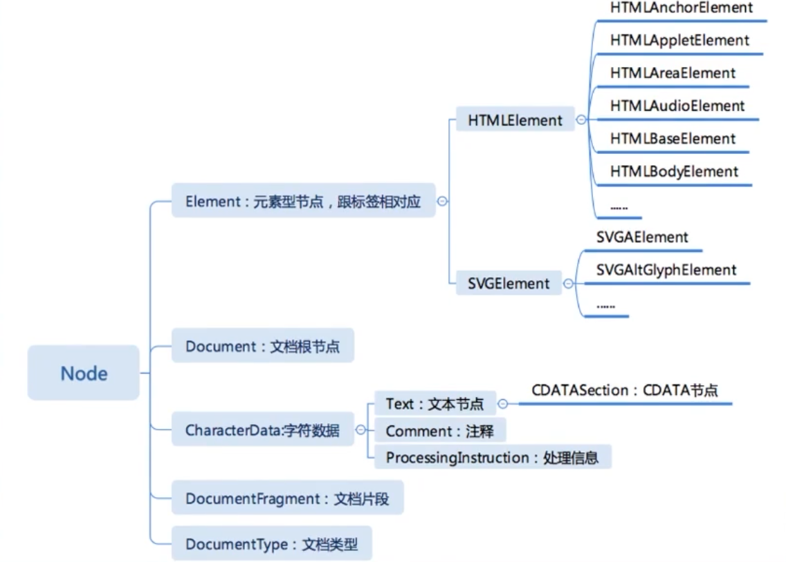
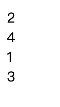
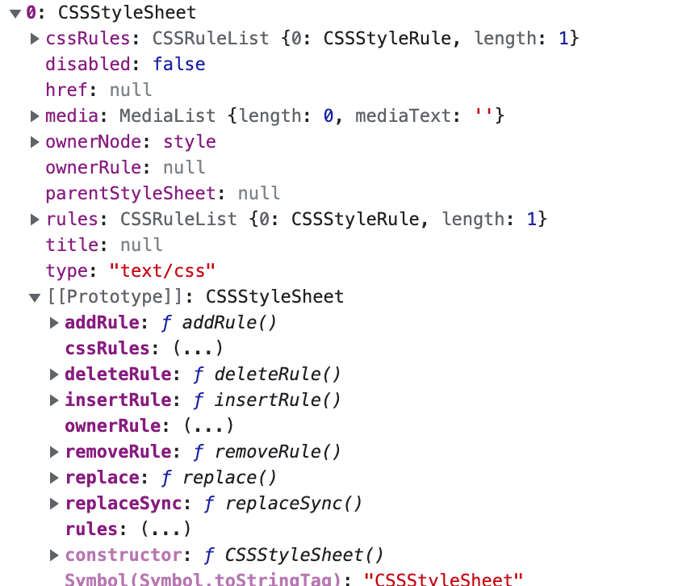
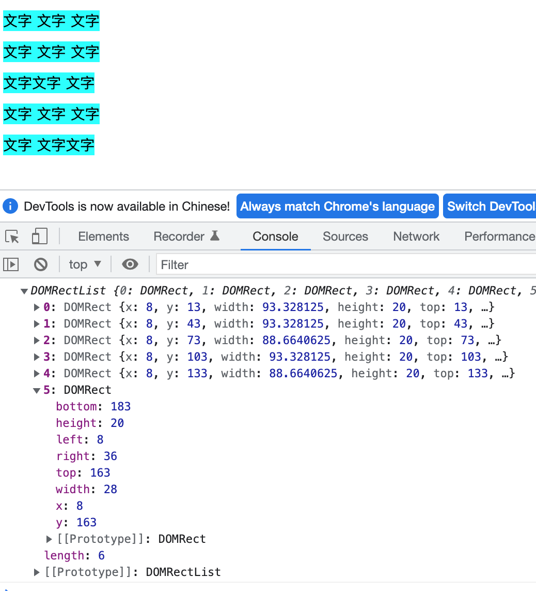

# 浏览器 API

浏览器 API 可以分为: 

- DOM API
- CSSOM
- 等...

## DOM

DOM API 包含三块

- DOM Tree
- Events
- Range

### DOM Tree

DOM Tree 单元就是 Node。



#### 节点的操作

**访问**

- parentNode
- childNodes
- firstChild
- lastChild
- nextSibling
- previousSibling

上面还有对应的 Element 版本。

- parent
- children
- firstElementChild
- lastElementChild
- nextElementSibling
- previousElementSibling

**修改操作**

- appendChild
- insertBefore
- removeChild
- replaceChild

注: 

- 所有的节点都只有一个 parent，所以操作如插入两次节点时，它实际会把上一个删除(取出)后再插入。
- 所有的操作都会实时改变如 childNodes 的值。

下面的代码移动节点时会不符合预期。

```html
<div id="app">
    <div></div>1</div>
    <div>2</div>
    <div>3</div>
    <div>4</div>
</div>
<div id='app2'></div>
<script>
  var app = document.querySelector('#app')
  var app2 = document.querySelector('#app2')

  // 下面这个移动因为 app.children 是动态的，所以会存在问题
  for (var i = 0; i < app.children.length; i++) {
    app2.appendChild(app.children[i])
  }
</script>
```

执行后的结果如下：




**高级操作**

- compareDocumentPosition 用于比较两个节点中关系的函数
- contains 检查一个节点是否包含另一个节点的函数
- isEqualNode 检查两个节点是否完全相同
- isSameNode 检查是否是同一个节点，实际可以用 `===`
- cloneNode 复制一个节点，传入 true 可以深拷贝

### Event

EventTarget

```js
target.addEventListener(type, listener[, useCapture])

target.addEventListener(type, listener[, options])
options = {
  capture: false, // default false
  once: false, // default false
  passive: false, // 如果是 true, 将不会调用 preventDefault(), 它可以提升页面滑动的流畅度
}
```

**理解passive**

> 如果我们在 touchstart 事件调用 preventDefault 会怎样呢？这时页面会禁止，不会滚动或缩放。

当你触摸滑动页面时，页面应该跟随手指一起滚动。而此时你绑定了一个 touchstart 事件，你的事件大概执行 200 毫秒。这时浏览器就犯迷糊了：如果你在事件绑定函数中调用了 preventDefault，那么页面就不应该滚动，如果你没有调用 preventDefault，页面就需要滚动。但是你到底调用了还是没有调用，浏览器不知道。只能先执行你的函数，等 200 毫秒后，绑定事件执行完了，浏览器才知道，“哦，原来你没有阻止默认行为，好的，我马上滚”。此时，页面开始滚。

- [移动Web滚动性能优化: Passive event listeners](https://zhuanlan.zhihu.com/p/24555031)

**事件流**

- 冒泡
- 捕获

### Range API

```js
// 方式1
var range = new Range()
range.setStart(element, 9)
range.setEnd(element, 4)

// 方式2
var range = document.getSelection().getRangeAt(0)
```

- setStart(node, index) 如果 node 为 text 或 comment 节点, index 是字符位置,如果是元素节点，则为子节点位置
- setStartBefore(node)
- setEndBefore(node)
- setStartAfter(node)
- setEndAfter(node)
- selectNode(node)
- selectNodeContents(el)
- extractContents() 将 range 选中的节点摘除
- insertNode() 在 range 选中的起始位置插入

range 的作用:可以摘取片段为 fragment, 或者往节点内部插入

```js
var fragment = range.extractContents()
range.insertNode(document.createTextNode('aaaa'))
```

## CSSOM

document.styleSheets

Data URI scheme是在RFC2397中定义的，目的是将一些小的数据，直接嵌入到网页中，从而不用再从外部文件载入。

```
data:,文本数据
data:text/plain,文本数据
data:text/html,HTML代码
data:text/html;base64,base64编码的HTML代码
data:text/css,CSS代码
data:text/css;base64,base64编码的CSS代码
data:text/javascript,Javascript代码
data:text/javascript;base64,base64编码的Javascript代码
data:image/gif;base64,base64编码的gif图片数据
data:image/png;base64,base64编码的png图片数据
data:image/jpeg;base64,base64编码的jpeg图片数据
data:image/x-icon;base64,base64编码的icon图片数据
```

CSSStyleSheet 继承自 StyleSheet



**Rule**

- CSSStyleRule
  
### getComputedStyle

用于获取计算后的属性。

```js
window.getComputedStyle(elt, pseudoElt)
```

- elt 想要获得的元素
- pseudoElt: 可选，伪元素

childWindow

```js
let childWindow = window.open("about:blank", "_blank")
let childWindow = window.open("about:blank", "_blank", "width=100,height=100,left=100")

childWindow.moveBy(-50, 50)
childWindow.resizeBy(50, 50)
```

window

```js
window.scroll(0, 0)
window.resize()
window.scrollX // number
window.scrollY

// 视口的尺寸
window.innerWidth
window.innerHeight = document.documentElement.getBoundingClientRect()

debugger 的尺寸: window.outerWidth - window.innerWidth

// screen 是和硬件相关的

window.devicePixelRatio // 一个逻辑像素是多少个物理像素

el.scrollBy(0, 0)
el.scrollTo(0, 0)
el.scrollTop
el.scrollLeft
el.scrollHeight


// 是一个数组, 多行文字会产生多个盒
el.getClientRects()[0]
el.getBoundingClientRect() // 是按照实际渲染位置来的，不会算滚动
```



## BOM


## Web Animation

## Crypto
