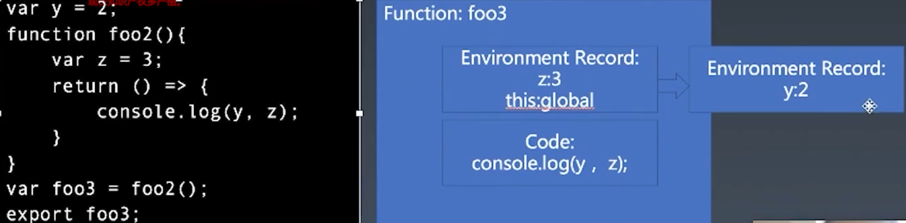

# js 结构化

## 宏任务和微任务

- 它的来源是宏内核和微内核，从操作系统角度说，微就是程序告诉某个单元做一件事，如让读取文件内容。宏(批处理)是告诉操作系统做一件事，如下载文件，它会调用网络请求和写文件服务。所以宏指大，微指小。
- 同步到浏览器, 宏任务(v8外控制)就是浏览器去执行的事情，如发送请求，然后用 v8 执行回调函数。微任务就是 v8 引擎js 所做的事情, 如执行某段 js 代码，微任务是 v8 模拟的，是语法层面的概念。

```
// 每个 evaluateScript 会产生一个宏任务
evaluateScript(`var a = 1; var b = 2`) // 这个宏任务有 1 个微任务
evaluateScript(`Promise.resolve().then(()=>var c = 3;)`) // 这个宏任务有 2 个微任务, then 会产生一个微任务
```

**为什么要区分宏任务和微任务？**

区分宏任务和微任务，是为了在下一次 Event loop 之前插队。将微任务插入到下次 Event Loop 之前。如果不区分, 那么新注册的任务要等到下次宏任务完成后才能执行。

宏任务是多线程异步逻辑，微任务是 js 语言本地异步(延迟执行)。

**微任务有哪些**

- promise： 别名叫延迟执行语句
- mutation observer 为什么是微任务？因为 DOM 解析等过程发生在主线程

promise 是针对函数进行异步(延迟异步), 不是针对事件循环。nodejs 在没有 promise 时，nextTick 在本轮循环结束执行，immediate 在下个事件循环开头执行。

为了防止多线程共享内存通讯，内存被意外修改而导致主线程需要加锁，调度线程会在事件循环结束而下一次事件轮询（epoll）还未开始的时候，直接挂起主线程，而在下一次事件轮询开始后再唤醒而为了加速上下文切换（操作系统接手后，需要把内存空间从用户态转换成内核态），减少上下文切换的耗时，操作系统利用独立的内存空间和独立的硬件来实现内存空间映射，具体参考这篇文章 —— 阿里二面：什么是mmap？ - 知乎 (zhihu.com)

**宏任务有哪些**

- 全局代码执行
- setTimeout
- ajax
- 读写文件

加锁: 控制共享资源不能被其他进程访问。同一时刻只有一个线程持有锁,其他线程想再获取这个锁,就会阻塞,这样就能保证拥有锁的线程可以安全的执行临界资源的代码,不用担心线程的上下文切换。

## Realm

- JS Context => Realm
- 宏任务
- 微任务
- 函数调用
- 语句/声明
- 表达式
- 直接量/变量/this

获取所有 Realm 对象的方法列表。

G6 Graph 可视化这个对象

## 函数执行

函数执行会创建执行上下文，并压入到执行栈。

Execution Context 分为两种

- ECMAScript Execution Context
	- code evaluation state
	- Function
	- Script or Module
	- Realm
	- LexicalEnvironment
	- VariableEnvironment
- Generator Execution Context
	- code evaluation state
	- Function
	- Script or Module
	- Realm
	- LexicalEnvironment
	- VariableEnvironment
	- Generator

LexicalEnviroment

- this 普通函数是执行时确定，箭头函数是指向上级的 this
- new.target
- super
- 变量

VariableEnvironment

- 用于处理 var 声明，历史遗留的包袱

```
{
	let y = 2
	eval('var x = 1')
}
with({a:1}){
	eval('var x') // 声明到了函数体里
}
console.log('x', x)
```

Environment Record

- Enviroment Record 基类
- Declarative Enviroment Record
- Global Enviroment Record
- Object Enviroment Record
- Function Enviroment Record
- module Enviroment Record

Function - Closure(闭包的机制)

```
var y = 2
function foo2(){
	console.log(y) 
	/** 这里的执行上下文对象 
	* { Environment Record: {y: 2}, 
	*		Code :`console.log(y)`
	*	}
	*/
}
export foo2
```



### Realm 领域

在执行前, 所有 es 代码都必须和 Realm 有关，一个 Realm 包含

- 一组内置对象
- 全局环境
- 在该全局环境所加载的所有 es 代码以及其他相关的状态和资源

在 Web 浏览器中，每个 window 和 iframe、WebWorker、ServerWorker 都有自己的 Realm，并带有单独的全局变量。这可以防止 instanceof 为跨 Realm 的对象工作。

```js
// iframe
window.parent.someFunction(["hello", "world"]);

// parent
function someFunction(arg) {
  if (arg instanceof Array) {
    // ... operate on the array
  }
}
```

Realm Record Fields 包含

{
	[[Intrinsics]], // 代码中用到的当前 realm 的内在对象
	[[GlobalObject]], // 当前 realm 的全局对象
	[[TemplateMap]], // 
	[[HostDefined]], // 供当前 realm 关联的主机环境使用的保留字段
}
